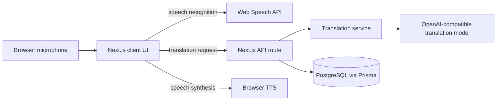

# System Architecture

## Layers

The MVP is intentionally small, but each layer is isolated so it can be split into separate services later without rewriting the product surface.

- Client layer: captures speech, renders live transcript, manages source and target languages, and plays translated audio.
- API layer: validates requests, calls the translation provider, and returns a normalized translation response.
- Provider layer: wraps the ML provider behind a stable interface so the model can change without impacting the client.
- Data layer: stores sessions, user language preferences, and translation events in PostgreSQL.

## Scale Path

The first deploy can run as a single Next.js app. At higher scale, move the translation provider and persistence into separate stateless services, add caching for repeated phrases, and stream translation jobs through a queue when real-time volume increases.

## Reliability Decisions

- Browser speech recognition is used for the MVP because it ships fast.
- Translation runs on the server to keep provider keys private.
- The provider is abstracted so OpenAI, DeepL, or a self-hosted model can be swapped later.
- Database writes are append-only for translation events so analytics and replay remain simple.